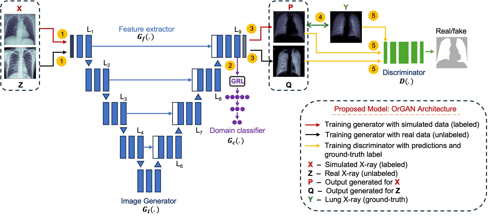

# OrGAN: Towards organ-level image separation in projection radiographs using generative AI 

 This repo contains the supported pytorch code and configuration files to reproduce the results of "OrGAN: Towards organ-level image separation in projection radiographs using generative AI" Article. 

# Abstract

 
Chest X-rays are widely used to diagnose conditions such as fractures, pneumonia, COPD, asthma, pneumothorax, and other lung-related diseases. However, overlapping anatomical structures often obscure critical abnormalities, reducing diagnostic accuracy and leading to high inter-observer variability. Organ-level image separation from X-rays has the potential to excel organ-focused diagnostics in radiographs, surpassing the limitations of traditional segmentation. While significant research has been done on organ segmentation in projection radiographs, organ-level image separation remains underexplored. To address this gap, we propose OrGAN, a generative adversarial framework designed to separate organ-level images from projection radiographs. This study focuses on isolating lung tissue images from chest X-rays, providing radiologists with organ-specific insights to complement conventional radiographs. OrGAN was trained on two data sources- simulated X-rays (labeled) generated from CT volumes and real X-rays (unlabeled). A modified U-Net based image generator, inspired by domain adversarial algorithms, was employed for image separation, while a CNN based discriminator further guided the image translation process. The performance of our proposed method was evaluated on three public datasets of real X-rays. Additionally, qualitative assessments of the lung X-rays were conducted by 10 radiologists from multiple hospitals in Bangladesh. Our findings demonstrate that the separated lung X-ray images enhanced the visibility of lung features and is helpful in diagnosis when used alongside conventional radiographs. This simple yet powerful GAN-based approach addresses a long-standing challenge in medical imaging. OrGAN offers a novel solution for multi-organ image separation from projection radiographs, paving the way for organ-focused disease diagnosis using X-rays.

# Proposed Architecture: OrGAN

# Data Link
https://drive.google.com/drive/folders/1gISKPOiDuZTAXkGeQ6-TMb3190v4Xhyc

# Sample Output 

# Requirements
pip install requirements.txt
